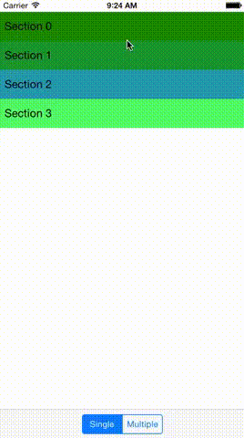

# ExpandableColumnLayout

[](https://travis-ci.org/John Volk/ExpandableColumnLayout)
[](http://cocoapods.org/pods/ExpandableColumnLayout)
[](http://cocoapods.org/pods/ExpandableColumnLayout)
[](http://cocoapods.org/pods/ExpandableColumnLayout)

A custom `UICollectionViewLayout` that provides a flexible column-based layout with optional expandable drawer functionality.

* Arbitrary column count per section
* Specifiy unit-height or exact height per item
* Expand or contract sections via attractive drawer-like animation



## Installation

`ExpandableColumnLayout` is available through [CocoaPods](http://cocoapods.org). To install
it, simply add the following line to your Podfile:

```ruby
pod "ExpandableColumnLayout"
```

## Usage

`ExpanableColumnLayout` relies on an instance of `ExpandableColumnLayoutDelegate` to provide the information it needs to build the layout. `ExpandableColumnLayoutDelegate` is a sub-type of `UICollectionViewDelegate` and so inherits any of the required behavior of that protocol. In addition, it adds some required behavior of it's own.

The following two methods _must_ be implemented

```swift
func numberOfColumnsInCollectionView(collectionView: UICollectionView,
  layout expandableColumnLayout: ExpandableColumnLayout,
  forSectionAtIndex section: Int) -> Int;
    
func collectionView(collectionView: UICollectionView,
  layout expandableColumnLayout: ExpandableColumnLayout,
  sectionIsExpandedAtIndex section: Int) -> Bool;
```

Additionally, `ExpandableColumnLayoutDelegate` instances _must_ provide either an exact height or a unit height for each item in a section. There are two ways to accomplish this. Pick whichever makes the most sense for your application.

```swift
optional func collectionView(collectionView: UICollectionView,
  layout expandableColumnLayout: ExpandableColumnLayout,
  itemHasExactHeightAtIndexPath indexPath: NSIndexPath!) -> Bool;
    
optional func collectionView(collectionView: UICollectionView,
  layout expandableColumnLayout: ExpandableColumnLayout,
  exactHeightForItemAtIndexPath indexPath: NSIndexPath!,
  withWidth width: CGFloat) -> CGFloat;
```

*OR*

```swift
  optional func collectionView(collectionView: UICollectionView,
    layout expandableColumnLayout: ExpandableColumnLayout,
    unitHeightForItemAtIndexPath indexPath: NSIndexPath!) -> Int;
```

#### ExpandableColumnViewController

The quickest way to get going is to subclass the provided `ExpandableColumnViewController`. This is the method used in the example project. When you subclass `ExpandableColumnViewController` there are two methods that you need to override in addition to the standard `ExpandableColumnLayoutDelegate` / `UICollectionViewDelegate` / `UICollectionViewDataSource` methods.

```swift
public func numberOfItemsInExpandedSection(section: Int) -> Int {
  ...
}

public func viewForSupplementaryHeaderElementAtIndexPath(indexPath: NSIndexPath) -> UICollectionReusableView {
  ...
}
```

The method `viewForSupplementaryHeaderElementAtIndexPath:` method only needs to be overriden if you are returning a non-CGZero size from your optional implementation of:

```swift
optional func collectionView(collectionView: UICollectionView,
  layout expandableColumnLayout: ExpandableColumnLayout,
  sizeForHeaderInSection section: Int) -> CGSize;
```

## Author

John Volk, john.t.volk@gmail.com

## License

ExpandableColumnLayout is available under the MIT license. See the LICENSE file for more info.
